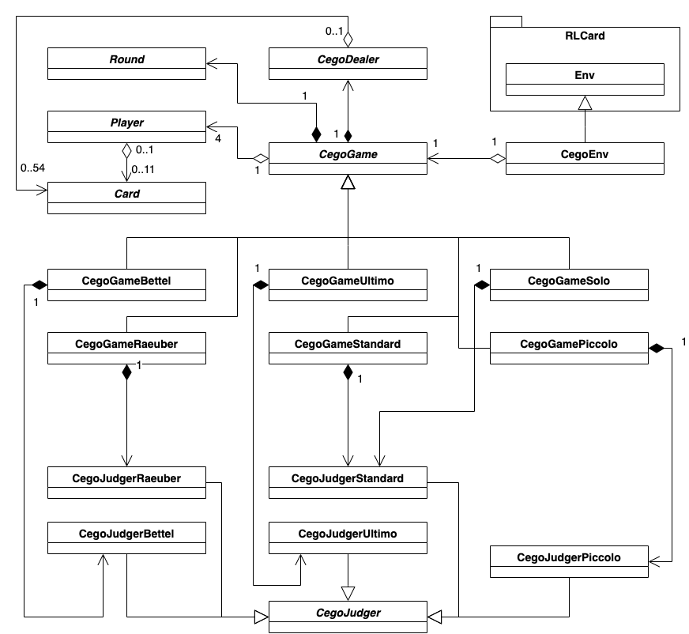

# An Application of Modern Reinforcement Learning Algorithms to The Card Game Cego 

## General Information

* **supervised by**:  Prof. Dr. Maja Temerinac-Ott
* **cosupervised by**: Prof. Jirka Dell´Oro-Friedl
* **submitted on**: 31.08.2022
* **submitted by**: 
    * Philipp Oeschger
    * matriculation number: 268388
    * Bregstraße 90
    * 78120 Furtwangen im Schwarzwald
    * philipp.oeschger@hs-furtwangen.de

* [Link to Master Thesis](thesis/Philipp_Oeschger_268388_Master_Thesis.pdf)
* The folder [src](src) contains the source code of this thesis

## About this Repository

This repository contains the full source code of the thesis.

The repository is a fork of [RLCard](https://github.com/datamllab/rlcard) and, therefore, the **src/rl_env** folder contains external source code. The following files / folders in **src/rl_env** do contain **self created** code:

* [src/rl_env/rlcard/games/cego](src/rl_env/rlcard/games/cego)
* [src/rl_env/rlcard/envs/cego.py](src/rl_env/rlcard/envs/cego.py)
* [src/rl_env/rlcard/agents/human_agents/cego_human_agent.py](src/rl_env/rlcard/agents/human_agents/cego_human_agent.py)
* [src/rl_env/results](src/rl_env/results)
* [src/rl_env/python_scripts](src/rl_env/python_scripts)

## Description of source code stucture the structure:

### Class Diagramm of Game Implementation:


### File Stucture of **src** folder:

#### Deep-AI-Service
The API that makes the AI-models available.

* this is a seperate service that requires a seperate setup
* [more details here](src/deepl-ai-service/README.md)

#### RL-Env

* [rlcard/games/cego](src/rl_env/rlcard/games/cego): The implementation of the game logic.
    * [jsondata](src/rl_env/rlcard/games/cego/jsondata): contains card encoding, high cards and low cards list.
    * [testing](src/rl_env/rlcard/games/cego/testing): contains script for testing the environment
    * [utility](src/rl_env/rlcard/games/cego/utility): contains utility function modules for:
        * [evaluations](src/rl_env/rlcard/games/cego/utility/eval.py)
        * [game implementation](src/rl_env/rlcard/games/cego/utility/game.py)
        * [custom logging](src/rl_env/rlcard/games/cego/utility/MyLogger.py)
        * [random search Hyperparameter optimization](src/rl_env/rlcard/games/cego/utility/random_search.py)
        * [training](src/rl_env/rlcard/games/cego/utility/training.py)
    * ... game classes described in class diagram
* [rlcard/envs/cego.py](src/rl_env/rlcard/envs/cego.py): The environment class for the game.
* [rlcard/agents/human_agents/cego_human_agent.py](src/rl_env/rlcard/agents/human_agents/cego_human_agent.py): An agent that serves as testing interface to play against AI models.
* [results](src/rl_env/results): contains various results, including 
    * [analysis results](src/rl_env/results/analysis_results),
    * [evaluations](src/rl_env/results/evaluation), 
    * [model training](src/rl_env/results/final_models), 
    * [random search results](src/rl_env/results/random_search_results).
* [python_scripts](src/rl_env/python_scripts): script for training, hyperparameter search and evaluation.
    * [cego_random_search](src/rl_env/python_scripts/cego_random_search): random search scripts for dqn and nfsp.
    * [final_model_training](src/rl_env/python_scripts/final_model_training): contains,
        * evaluation of models
        * analysis of the game environment
        * scripts for final dmc, dqn, and nfsp training
    * [interactive_cego_testing](src/rl_env/python_scripts/interactive_cego_testing): contains a test script for playing against a model in the command line


## Setting up the Environment

The following tools are needed to setup the environment:

* [Python 3](https://www.python.org/downloads/) (Python 3.9 was used)
* [Virtualenv](https://pypi.org/project/virtualenv/)

### Open rl_env_folder

```bash
cd src/rl_env
```

### Create an environment


```bash
python3 -m venv venv
```

### Activate Environment

MacOS:

```bash
source venv/bin/activate
```

Linux:

```bash
source venv/Scripts/activate
```

Windows:

```bash
.\venv\Scripts\activate
```

### Install the Dependencies

1.

```bash
pip install -r requirements.txt
```

2.

```bash
pip3 install -e .
```

### Run Tests for RL-Env:

```bash
python -m unittest discover 
```